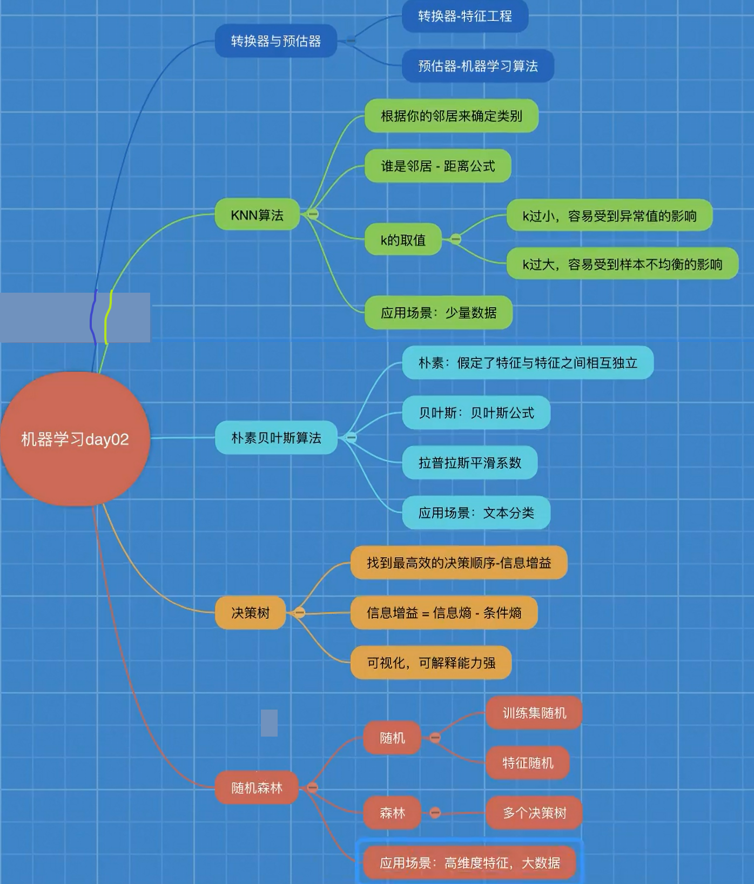

# 特征工程

## 特征抽取

### 字典特征提取

- 应用 DictVectorizer 实现对类别特征进行数值化、离散化

### 文本特征提取

- 应用 CountVectorizer 实现对文本特征进行数值化
- 应用 TfidfVectorizer 实现对文本特征进行数值化

## 特征预处理

- 应用 MinMaxScaler 实现对特征数据进行归一化
- 应用 StandardScaler 实现对特征数据进行标准化

## 特征降维

### 特征选择

- Filter(过滤式)：主要探究特征本身特点、特征与特征和目标值之间关联
  - 方差选择法：低方差特征过滤 VarianceThreshold
  - 相关系数 pearsonr

- Embedded (嵌入式)：算法自动选择特征（特征与目标值之间的关联）
  - 决策树:信息熵、信息增益
  - 正则化：L1、L2
  - 深度学习：卷积等

### 主成分分析

- 应用PCA实现特征的降维

# 总结1

# 分类算法

## sklearn转换器和估计器

## K-近邻算法(KNN)

## 模型选择与调优

## 朴素贝叶斯算法

## 决策树

## 集成学习方法之随机森林

# 总结2

# 回归算法

## 线性回归

## 欠拟合与过拟合

## 岭回归

带有L2正则化的线性回归-岭回归

alpha  正则化力度 = 惩罚项系数

## 分类算法-逻辑回归

## 模型的保存和加载

保存：joblib.dump(estimator, 'test.pkl')

加载：estimator = joblib.load('test.pkl')

# 聚类算法

## 无监督学习-K-means算法

- 无监督学习包含算法

  - 聚类：K-means(K均值聚类)

  - 降维：PCA

# 总结3

