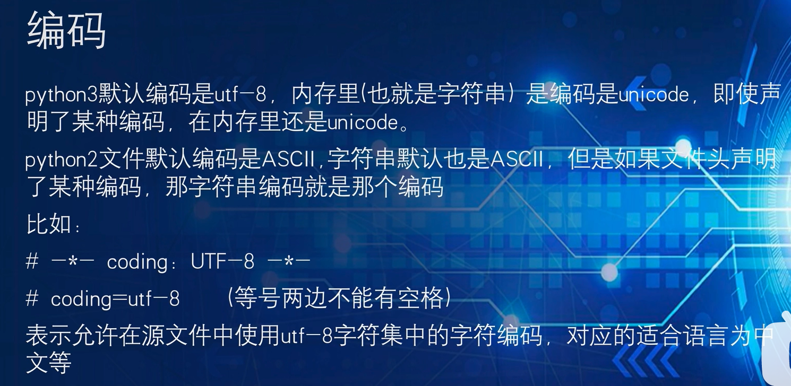

# 第一章

## Python解释器

- 计算机只认识0和1

- Python解释器的作用是

  将Python代码翻译成计算机认识的0和1并提交计算机执行

  在解释器环境内可以一行行的执行我们输入的代码

  也可以使用解释器程序，去执行”.py”代码文件

- “.py”文件是什么？

  python语言的代码文件，里面记录了python的代码

- Python解释器程序存放在

  <Python安装目录>/python.exe

  我们在CMD（命令提示符）程序内，执行的python，就是python.exe程序。


## Python开发工具

- Python程序的开发有许多种方式，一般我们常见的有：

  1. Python解释器环境内，执行单行代码

  2. 使用Python解释器程序，执行Python代码文件

  3. 使用第三方IDE（集成开发工具），如PyCharm软件，开发Python程序

- PyCharm需要以“工程”为单元，供我们使用。想要写代码需要先创建一个工程。


## 编码




# 第二章 基础语法

## 一、字面量

在代码中，被**写下来**的固定的**值**，称之为字面量。


## 二、注释

1. 注释的作用是？
注释是代码中的解释型语句，用来对代码内容进行注解
注释不是代码，不会被程序执行
2. 单行注释如何定义？
通过 # 号定义，在#号右侧的所有内容均作为注释
建议在#号和注释内容之间，间隔一个空格
单行注释一般用于对：一行或一小部分代码进行解释 
3. 多行注释如何定义？
通过一对三个引号来定义("""注释内容""")，引号内部均是注释，可以换行
多行注释一般对：Python文件、类或方法进行解释

```python
# 这是一个单行注释

"""
多行注释一般对：
- Python文件
- 类
- 方法
进行解释
"""

```


## 三、变量

- 变量：**在程序运行时**，能储存计算结果或能表示值的抽象概念。

  简单的说，变量就是在程序运行时，记录数据用的

- 变量的定义格式

  变量名称 = 变量的值

  每一个变量都有自己的名称，称之为：**变量名，也就是变量本身**

  每一个变量都有自己存储的值（内容），称之为：**变量值**

  = 赋值，表示将等号**右侧的值，赋予左侧的变量**

- 变量的特征是，变量存储的数据，是可以发生改变的。

- 变量的命名**规范**

  - 见名知意

  - 下划线命名法

  - 英文字母全小写

```python
# Python变量名通常使用下划线连接命名
user_name = '张三'
```


## 四、数据类型

- 使用type()语句查看数据的类型

- 变量无类型而数据有类型

  - 通过 type(变量) 可以输出类型，查看的是：变量存储的数据的类型。因为，变量无类型，但是它存储的数据有。

  - 字符串变量：不是变量是字符串，而是它存储了字符串


### 数值

```python
# 数值类型
age = 18
money = 123.5
c = 12 + 4.2j
print(type(age))  # <class 'int'>
print(type(money))  # <class 'float'>
print(type(c))  # <class 'complex'> 复数
```


### 字符串

字符串（string），又称文本，是由任意数量的字符如中文、英文、各类符号、数字等组成。所以叫做字符的串。

Python中，字符串需要用双引号（"）包围起来。
被引号包围起来的，都是字符串。

```python
# 字符串字面量用单引号或双引号括起
name1 = 'jack'
name2 = "tom"
print(name1, name2)  # jack tom
message1 = '小明说："下雨啦"'
print(message1)  # 小明说："下雨啦"
message2 = "小红说：'下雨啦'"  
print(message2)  # 小红说：'下雨啦'

# 多行字符串
# 三引号：保留格式输出
message3 = '''
hello
   world
'''
print(message3)
print(type(message3))  # <class 'str'>
```


### 布尔


```python
# 布尔类型
flag = True
print(type(flag))  # <class 'bool'>
print(flag)  # True

flag = 1 + True
print(flag)  # 2
flag = 1 + False
print(flag)  # 1

x = 10  # 0 "" '' 是False
if x:
    print("+++++")
else:
    print("-----")
```


## 五、数据类型转换


```python
# 数据类型转换
# str --> int, float
str_int = "30"
str_float = "25.67"
num_int = int(str_int)
num_float = float(str_float)
print(type(num_int), num_int)  # <class 'int'> 30
print(type(num_float), num_float)  # <class 'float'> 25.67

# int, float --> str
num_int = 20
num_float = 15.784
str_int = str(num_int)
str_float = str(num_float)
print(type(str_int), str_int)  # <class 'str'> 20
print(type(str_float), str_float)  # <class 'str'> 15.784

# int <--> float
num_int = 45
int_2_float = float(num_int)
print(type(int_2_float), int_2_float)  # <class 'float'> 45.0
num_float = 23.56
float_2_int = int(num_float)
print(type(float_2_int), float_2_int)  # <class 'int'> 23

# str --> int, float
str_float = "45.87"
# num_int = int(str_float)  # ValueError: invalid literal for int() with base 10: '45.87'
str_int = "80"
num_float = float(str_int)
print(type(num_float), num_float)  # <class 'float'> 80.0

# 进制转换
a = 8
print(bin(a))  # 0b1000
print(oct(a))  # 0o10
print(hex(a))  # 0x8

```

- 注意事项

  1. 任何类型，都可以通过str()，转换成字符串

  2. 字符串内必须只有数字，才可以将字符串转换为数字
  3. 浮点数转整数会丢失精度，也就是小数部分


## 六、标识符

- 在Python程序中，我们可以给很多东西起名字，比如：**变量**的名字、**方法**的名字、**类**的名字，这些名字，统一称之为标识符，用来做内容的标识。
- 用户编写代码时，对变量、类、方法等编写的名字，叫做标识符。

- Python中，标识符的命名**规则**

  - 内容限定

    - 标识符由英文字母、数字、下划线组成
    - 不能使用数字开头，即第一个字符必须是字母或下划线

  - 标识符对大小写敏感

  - 不可使用关键字

    - 可以使用下面代码查看关键字

      ```python
      import keyword
      
      print(keyword.kwlist)
      ```

- 变量名、类名、方法名，不同的标识符，有不同的命名**规范**

  - 变量的命名规范

    - 见名知意
    - 下划线命名法
    - 英文字母全小写                          
- 不遵守规则，会出现问题。不遵守规范，不太高级。


## 七、运算符


## 八、字符串扩展

- 字符串的三种定义方式
  - 单引号方式
  - 双引号方式
  - 三引号方式
- 引号的嵌套
  - 可以使用 \ 来进行转义
  - 单引号内可以写双引号或双引号内可以写单引号

- 字符串拼接
  - 使用 + 号连接字符串变量或字符串字面量，无法和非字符串类型进行拼接
- 字符串格式化（通过占位的形式拼接字符串）
  - 语法："占位符" % 变量
  - 常用占位符：%s  %d  %f
- 格式化字符串的过程中做数字的精度控制
  - 语法：m.n的形式控制，如%5d、%5.2f、%.2f，m和.n均可省略
  - 如果m比数字本身宽度还小，m不生效
  - n会对小数部分做精度限制，同时会对小数部分做四舍五入
- 快速格式化
  - 语法：f"内容{变量}"
  - 这种方式：不理会类型、不做精度控制，适合对精度没有要求的时候快速使用
- 对表达式进行格式化
  - f"{表达式}"
  - "占位符" % 表达式


## 九、数据输入、输出

### print()

```python
# print(self, *args, sep=' ', end='\n', file=None) 默认

print(10, "jack", 20.9, sep=',')

print(10, end=' ')
print(20)
```

### input()

- input() 语句的功能是，获取键盘输入的数据

- 可以使用：input(提示信息)，用以在使用者输入内容之前显示提示信息
- 无论键盘输入什么类型的数据，获取到的数据**永远都是字符串类型**


# 第三章 判断语句

## 布尔类型和比较运算符

- 在 Python 中，可以表示真假的数据类型是：布尔类型，字面量 True 表示真，字面量 False 表示假

- 除了可以定义布尔类型外，还可以通过<比较运算符>计算得到布尔类型的结果
  - == ，!= ，> ，< ，>= ，<=


## if 语句

```python
if age >= 18: # 判断条件
    print("我已经成年了")
    print("即将步入大学生活")
```

- if 语句的注意事项：

  - 判断条件的结果一定要是布尔类型

  - 不要忘记判断条件后的： 冒号

  - 归属于 if 语句的代码块，需在前方填充 4 个空格缩进


## if else 语句

```python
if age >= 18:
    print("我已经成年了")
    print("即将步入大学生活")
else:
    print("是未成年人")
```


## if elif else 语句

```python
if age >= 18:
    print("我已经成年了")
    print("即将步入大学生活")
elif age >= 12:
    print("已满12岁")
else:
    print("是小学生")
```


## 判断语句的嵌套

1. 嵌套判断语句可以用于多条件、多层次的逻辑判断

2. 嵌套判断语句可以根据需求，自由组合 if elif else 来构建多层次判断

3. 嵌套判断语句，一定要注意空格缩进，Python 通过空格缩进来决定层次关系


# 第四章 循环语句

## while 循环

```python
# while循环的语法格式
while 条件：
	条件满足时，做的事情

# 基础语法
i = 0
while i < 100:
    print("你好")
    i += 1
 
# 循环的嵌套
# 打印九九乘法表
i = 1
while i <= 9:
    j = 1
    while j <= i:
        print(f"{j}*{i}={j * i}\t", end='')
        j += 1
    i += 1
    print()
```

- while循环的注意事项
  - 条件需提供布尔类型结果，True继续，False停止
  - 空格缩进不能忘
  - 请规划好循环终止条件，否则将无限循环


## for 循环

> 从待处理数据集中：逐个取出数据赋值给临时变量。for 循环也被称为：遍历循环

```python
# for循环的语法格式
for 临时变量 in 待处理数据集: 
	循环满足条件时执行的代码

# 基础语法
name = "itheima"
for x in name:
    print(x)
    
# range语句:获得一个数字序列
# range(num)
# range(num1, num2)
# range(num1, num2, step)
for i in range(5):
    print(i)
  
# 循环的嵌套
# 打印九九乘法表
for i in range(1, 10):
    for j in range(1, i + 1):
        print(f"{j}*{i}={j * i}\t", end='')
    print()
```

- for循环的注意点
  - 无法定义循环条件，只能被动取出数据处理

  - 循环内的语句，需要有空格缩进

- for循环中的临时变量，其作用域限定为：循环内
  - 这种限定：
    是编程规范的限定，而非强制限定
    不遵守也能正常运行，但是不建议这样做
    如需访问临时变量，可以预先在循环外定义它


## 循环中断 : break 和 continue

1. continue 的作用是：中断所在循环的当次执行，直接进入下一次
2. break 的作用是：直接结束所在的循环
3. 注意事项：
continue 和 break，在 for 和 while 循环中作用一致
在嵌套循环中，只能作用在所在的循环上，无法对上层循环起作用


# 第五章 函数

## 函数介绍

1. 函数是：
组织好的、可重复使用的、用来实现特定功能的代码段
2. 使用函数的好处是：
将功能封装在函数内，可供随时随地重复利用
提高代码的复用性，减少重复代码，提高开发效率


## 函数的定义

```python
# 函数的定义
def 函数名(传入参数):
    函数体
    return 返回值


# 函数的调用
函数名(参数)

```

注意事项

① 参数如不需要，可以省略

② 返回值如不需要，可以省略

③ 函数必须先定义后使用


## 函数的参数

传入参数的功能是：在函数进行计算的时候，接受外部（调用时）提供的数据

```python
# 函数的定义
def add(x, y):
    result = x + y
    print(f"{x} + {y}的结果是：{result}")


# 函数的调用
add(3, 6)

```

函数定义中的参数，称之为形式参数
函数调用中的参数，称之为实际参数
函数的参数数量不限，使用逗号分隔开
传入参数的时候，要和形式参数一一对应，逗号隔开


## 函数的返回值

函数返回值：函数在执行完成后，返回给调用者的结果

使用关键字：return 来返回结果

```python
# 函数的定义
def add(x, y):
    result = x + y
    return result


# 函数的调用
r = add(3, 6)
```


### None类型

如果函数没有使用return语句返回数据，那么函数有返回值吗？实际上是：有的。

Python中有一个特殊的字面量：None，其类型是：<class 'NoneType'>

无返回值的函数，实际上就是返回了：None 这个字面量

None表示：空的、无实际意义的意思

函数返回的 None，就表示，这个函数没有返回什么有意义的内容。也就是返回了空的意思。


None可以主动使用return返回：return None，效果等同于不写 return 语句。


- 使用场景

  1. 用在函数无返回值上

  2. 用在 if 判断上

     在 if 判断中，None 等同于 False

     一般用于在函数中主动返回 None，配合 if 判断做相关处理

  3. 用于声明无内容的变量上

     定义变量，但暂时不需要变量有具体值，可以用 None 来代替

```python
# None用于函数无返回值上
def say_hi():
    print("hello...")
    return None


res = say_hi()
print(res)
print(type(res))


# None用于if判断
def check_age(age):
    if age > 18:
        return "SUCCESS"
    else:
        return None


result = check_age(16)
if not result:
    print("未成年，不可以进入")

# None用于声明无初始内容的变量
name = None

```


## 函数说明文档

通过多行注释的形式，对函数进行说明解释，帮助更好理解函数的功能

内容应写在函数体之前

```python
# 定义函数，进行文档说明
def add(x, y):
    """
    add函数可以接收2个参数，进行2数相加的功能
    :param x: 形参x表示相加的其中一个数字
    :param y: 形参y表示相加的另一个数字
    :return: 返回值是2数相加的结果
    """
    result = x + y
    print(f"2数相加的结果是：{result}")
    return result


add(5, 6)
```


## 函数的嵌套调用

函数嵌套调用指的是一个函数里面又调用了另外一个函数。

执行流程：函数A中执行到调用函数B的语句，会将函数B全部执行完成后，继续执行函数A的剩余内容


## 变量的作用域

局部变量：是定义在函数体内部的变量，即只在函数体内部生效

全局变量：是在函数体内、外都能生效的变量

使用 global 关键字可以将函数内定义的变量声明为全局变量

```python
# global关键字，在函数内声明变量为全局变量
num = 200


def test_a():
    print(f"test_a: {num}")


def test_b():
    global num  # 设置内部定义的变量为全局变量
    num = 500
    print(f"test_b: {num}")


test_a()
test_b()
print(num)
```


## 函数多返回值

```python
# 使用多个变量，接收多个返回值
def test_return():
    return 1, "hello", True

x, y, z = test_return()
print(x)
print(y)
print(z)
```

按照返回值的顺序，写对应顺序的多个变量接收即可

变量之间用逗号隔开

支持不同类型的数据 return


## 函数多种传参方式

1. 位置参数

   根据参数位置来传递参数


2. 关键字参数

   通过“键=值”形式传递参数，可以不限参数顺序

   可以和位置参数混用，位置参数需在前


3. 缺省参数

   不传递参数值时会使用默认的参数值

   默认值的参数必须定义在最后


4. 不定长参数

   位置不定长传递以*号标记一个形式参数，以元组的形式接受参数，形式参数一般命名为args

   关键字不定长传递以**号标记一个形式参数，以字典的形式接受参数，形式参数一般命名为kwargs


## 匿名函数

### 函数作为参数传递

```python
# 定义一个函数，接收另一个函数作为传入参数
def test_func(compute):
    result = compute(1, 2)
    print(f"compute参数的类型是:{type(compute)}")
    print(f"计算结果：{result}")

# 定义一个函数，准备作为参数传入另一个函数
def compute(x, y):
    return x + y

# 调用，并传入函数
test_func(compute)
```

1. 函数本身是可以作为参数，传入另一个函数中进行使用的。

2. 将函数传入的作用在于：传入计算逻辑，而非传入数据。

### lambda 匿名函数

```python
# 定义一个函数，接受其它函数输入
def test_func(compute):
    result = compute(1, 2)
    print(f"结果是:{result}")
    
# 通过lambda匿名函数的形式，将匿名函数作为参数传入
test_func(lambda x, y: x + y)
```

1. 匿名函数使用 lambda 关键字进行定义

2. 定义语法：

   lambda  传入参数：函数体(一行代码)

3. 注意事项：

   匿名函数用于临时构建一个函数，只用一次的场景

   匿名函数的定义中，函数体只能写一行代码，如果函数体要写多行代码，不可用 lambda 匿名函数，应使用def 定义带名函数


# 第六章 数据容器

## 数据容器入门

1. 什么是数据容器？

   一种可以存储多个元素的Python数据类型

2. Python有哪些数据容器？

  list(列表)、tuple(元组)、str(字符串)、set(集合)、dict(字典)

  它们各有特点，是否支持重复元素，是否可以修改，是否有序


## list(列表)

### 列表的定义

```python
# 定义列表字面量
[元素1, 元素2, 元素3, ......]
# 定义列表变量
变量名称 = [元素1, 元素2, 元素3, ......]
# 定义空列表
变量名称 = []
变量名称 = list()
```

1. 列表的定义语法
[元素1, 元素2, 元素3, ......]
2. 什么是元素？
数据容器内的每一份数据，都称之为元素
3. 元素的类型有限制吗？
元素的数据类型没有任何限制，甚至元素也可以是列表，这样就定义了嵌套列表

### 列表的下标索引

1. 列表的下标索引是什么？
列表的每一个元素，都有编号称之为下标索引
从前向后的方向，编号从0开始递增
从后向前的方向，编号从-1开始递减
2. 如何通过下标索引取出对应位置的元素呢？
列表[下标]，即可取出
3. 下标索引的注意事项：
要注意下标索引的取值范围，超出范围无法取出元素，并且会报错

### 列表的方法


### 列表的特点

可以容纳多个元素（上限为2**63-1、9223372036854775807个）

可以容纳不同类型的元素（混装）

数据是有序存储的（有下标序号）

允许重复数据存在

可以修改（增加或删除元素等）

### 列表的遍历

可以使用 while 或 for 循环

```python
# while循环
index = 0
while index < len(列表):
    元素 = 列表[index]
    对元素进行处理
    index += 1
   

# for循环    
for 临时变量 in 列表:
    对临时变量进行处理
```


## tuple(元组)

### 元组的定义

```python
# 定义元组字面量
(元素, 元素, 元素, ......)
# 定义元组变量
变量名称 = (元素, 元素, 元素, ......)
# 定义空元组
变量名称 = ()
变量名称 = tuple()

# 定义1个元素的元组
变量名称 = (元素, ) # 元组只有一个数据，这个数据后面要添加逗号
```

### 元组的方法


不可以修改元组的内容，否则会直接报错

可以修改元组内的 list 的内部元素（修改元素、增加、删除、反转等）

不可以替换 list 为其它 list 或其它类型

### 元组的特点

可以容纳多个数据

可以容纳不同类型的数据（混装）

数据是有序存储的（下标索引）

允许重复数据存在

**不可以修改**（增加或删除元素等）

可以使用while循环和for循环遍历它


## str(字符串)

### 字符串的方法


### 字符串的特点

**只可以存储字符串**

长度任意（取决于内存大小）

支持下标索引

允许重复字符串存在

**不可以修改**（增加或删除元素等）

支持while循环和for循环进行遍历


## 序列

序列是指：内容连续、有序，可使用下标索引的一类数据容器

列表、元组、字符串，均可以视为序列。

### 序列的切片

序列支持切片，切片：从一个序列中，取出一个子序列

```python
# 语法
序列[起始下标:结束下标:步长]
```

表示从序列中，从指定位置开始，依次取出元素，到指定位置结束，得到一个新序列：

- 起始下标表示从何处开始，可以留空，留空视作从头开始

- 结束下标（不含）表示何处结束，可以留空，留空视作截取到结尾

- 步长表示，依次取元素的间隔
  步长1表示，一个个取元素
  步长2表示，每次跳过1个元素取
  步长N表示，每次跳过N-1个元素取
  步长为负数表示，反向取（注意，起始下标和结束下标也要反向标记）

注意，此操作不会影响序列本身，而是会得到一个新的序列（列表、元组、字符串）


## set(集合)

列表可修改、支持重复元素且有序

元组、字符串不可修改、支持重复元素且有序

集合，不支持元素的重复（自带去重功能）、并且内容无序

### 集合的定义

```python
# 定义集合字面量
{元素, 元素, 元素, ......}
# 定义集合变量
变量名称 = {元素, 元素, 元素, ......}
# 定义空集合
变量名称 = set()
```

### 集合的方法


### 集合的特点

可以容纳多个数据

可以容纳不同类型的数据（混装）

数据是无序存储的（不支持下标索引）

不允许重复数据存在

可以修改（增加或删除元素等）

支持for循环遍历，不支持while循环


## dict(字典、映射)

### 字典的定义

```python
# 定义字典字面量
{key:value, key:value, key:value, ......}
# 定义字典变量
变量名称 = {key:value, key:value, key:value, ......}
# 定义空字典
变量名称 = {}
变量名称 = dict()
```

Key和Value可以是任意类型的数据（key不可为字典）

字典内Key不允许重复，重复添加等同于覆盖原有数据

字典不可用下标索引，而是通过Key检索Value

### 字典的方法


### 字典的特点

可以容纳多个数据

可以容纳不同类型的数据

每一份数据是Key-Value键值对

可以通过Key获取到Value，Key不可重复（重复会覆盖）

不支持下标索引

可以修改（增加或删除更新元素等）

支持for循环遍历，不支持while循环


## 数据容器对比总结

数据容器可以从以下视角进行简单的分类：

- 是否支持下标索引

  - 支持：列表、元组、字符串 - 序列类型

  - 不支持：集合、字典 - 非序列类型

- 是否支持重复元素：

  - 支持：列表、元组、字符串 - 序列类型

  - 不支持：集合、字典 - 非序列类型

- 是否可以修改

  - 支持：列表、集合、字典

  - 不支持：元组、字符串


## 数据容器的通用操作


# 第七章 文件操作

## 文件的读取


## 文件的写入

1. 写入文件使用open函数的”w”模式进行写入

2. 写入的方法有：

   wirte()，写入内容

   flush()，刷新内容到硬盘中

3. 注意事项：

   w模式，文件不存在，会创建新文件

   w模式，文件存在，会清空原有内容

   close()方法，带有flush()方法的功能

   

## 文件的追加

1. 追加写入文件使用open函数的”a”模式进行写入

2. 追加写入的方法有（和w模式一致）：

   wirte()，写入内容

   flush()，刷新内容到硬盘中

3. 注意事项：

   a模式，文件不存在，会创建新文件

   a模式，文件存在，会在原有内容后面继续写入

   可以使用”\n”来写出换行符


# 第八章 异常

1. 什么是异常：

   异常就是程序运行的过程中出现了错误

2. bug是什么意思：

   bug就是指异常的意思，历史因为小虫子导致计算机失灵的案例，所以延续至今，bug就代表软件出现错误。

## 异常的捕获方法

```python
# 捕获常规异常
try:
    可能发生错误的代码
except:
    如果出现异常执行的代码

    
# 捕获指定异常
# ① 如果尝试执行的代码的异常类型和要捕获的异常类型不一致，则无法捕获异常。
# ② 一般try下方只放一行尝试执行的代码。
try:
    print(name)
except NameError as e:
    print('name变量名称未定义错误')
    

# 捕获多个异常
# 当捕获多个异常时，可以把要捕获的异常类型的名字，放到except 后，并使用元组的方式进行书写。
try:
    print(1/0)
except (NameError, ZeroDivisionError):
    print('ZeroDivision错误...')

    
# 捕获异常并输出描述信息
try:
    print(num)
except (NameError, ZeroDivisionError) as e:
    print(e)

    
# 捕获所有异常
try:
    print(name)
except Exception as e:
    print(e)

    
# 异常else
# else表示的是如果没有异常要执行的代码。
try:
    print(1)
except Exception as e:
    print(e)
else:
    print('我是else，是没有异常的时候执行的代码')

    
# 异常的finally
# finally表示的是无论是否异常都要执行的代码，例如关闭文件。
try:
    f = open('test.txt', 'r')
except Exception as e:
    f = open('test.txt', 'w')
else:
    print('没有异常，真开心')
finally:
    f.close()
    
```

1. 为什么要捕获异常？

   在可能发生异常的地方，进行捕获。当异常出现的时候，提供解决方式，而不是任由其导致程序无法运行。

2. 如何捕获所有异常？

   异常的种类多种多样，如果想要不管什么类型的异常都能捕获到，那么使用:

   except:

   except Exception:

   两种方式捕获全部的异常


## 异常的传递

```python
# 定义一个出现异常的方法
def func1():
    print("func1 开始执行")
    num = 1 / 0     # 肯定有异常，除以0的异常
    print("func1 结束执行")

    
# 定义一个无异常的方法，调用上面的方法
def func2():
    print("func2 开始执行")
    func1()
    print("func2 结束执行")


# 定义一个方法，调用上面的方法
def main():
    try:
        func2()
    except Exception as e:
        print(f"出现异常了，异常的信息是：{e}")

main()

```

- 异常是具有传递性的
- 当函数func01中发生异常，并且没有捕获处理这个异常的时候，异常会传递到函数func02，当func02也没有捕获处理这个异常的时候，main函数会捕获这个异常，这就是异常的传递性
- 当所有函数都没有捕获异常的时候，程序就会报错
- 利用异常具有传递性的特点，当我们想要保证程序不会因为异常崩溃的时候，就可以在main函数中设置异常捕获，由于无论在整个程序哪里发生异常，最终都会传递到main函数中，这样就可以确保所有的异常都会被捕获


# 第九章 模块、包

## Python模块

Python 模块(Module)，是一个 Python 文件，以 .py 结尾。

模块能定义函数，类和变量，模块里也能包含可执行的代码。我们可以导入进行使用。

### 导入Python内置的模块

```python
# 模块在使用前需要先导入，导入的语法如下:
[from 模块名] import [模块 | 类 | 变量 | 函数 | *] [as 别名]

# 常用的组合形式如：
import 模块名
from 模块名 import 类、变量、方法等
from 模块名 import *
import 模块名 as 别名
from 模块名 import 功能名 as 别名
```

### 自定义模块

```python
# 新建一个Python文件，命名为 my_module1.py，并定义函数
def test(a, b):
    print(a + b)
    
  
# __all__ 变量可以控制 import * 的时候哪些功能可以被导入
__all__ = ['test_A'] 


def test_A():
    print('testA')
    
    
def test_B():
    print('testB')
    

# 只在当前文件中调用该函数，其他已经导入了该模块的文件内不符合该条件，则不执行test函数调用
if __name__ == '__main__':
    test (1, 2)

```


```python
# 导入自定义模块使用
import my_module1

my_module1.test (10, 20)
```

注意事项：

- 当导入多个模块的时候，且模块内有同名功能。当调用这个同名功能的时候，调用到的是后面导入的模块的功能。（后导入的会覆盖先导入的）

- 如果一个模块文件中有 `__all__` 变量，当使用 `from xxx import *` 导入时，只能导入这个列表中的元素
- `if __name__ == '__main__'` 表示，只有当程序是直接执行的才会进入 if 内部，如果是被导入的，则 if 无法进入


## Python包

- 从物理上看，包就是一个文件夹，在该文件夹下包含了一个 `__init__.py` 文件，该文件夹可用于包含多个模块文件

- 从逻辑上看，包的本质依然是模块

- 包的作用：当我们的模块文件越来越多时，包可以帮助我们管理这些模块，包的作用就是包含多个模块，但包的本质依然是模块

### 自定义包

Pycharm 中的基本步骤:

[New]   -->   [Python Package]  -->   输入包名  -->   [OK]   -->   新建功能模块(有联系的模块)

注意：新建包后，包内部会自动创建`__init__.py`文件，这个文件控制着包的导入行为

```python
# 导入包
# 方式一
import 包名.模块名

包名.模块名.目标


# 方式二
# 注意：必须在`__init__.py`文件中添加`__all__ = []`，控制允许导入的模块列表
# __all__针对的是 from ... import * 这种方式，对 import xxx 这种方式无效

from 包名 import *

模块名.目标

```

1. 什么是Python的包？
包就是一个文件夹，里面可以存放许多Python的模块（代码文件），通过包，在逻辑上将一批模块归为一类，方便使用。
2. `__init__.py`文件的作用？
创建包会默认自动创建的文件，通过这个文件来表示一个文件夹是Python的包，而非普通的文件夹。
3. `__all__`变量的作用？
同模块中学习到的是一个作用，控制 import * 能够导入的内容

### 使用pip安装第三方包

- 在Python程序的生态中，有非常多的第三方包（非Python官方内置），可以安装它们扩展功能，提高开发效率。

  科学计算：numpy

  数据分析：pandas

  大数据计算：pyspark、apache-flink

  图形可视化：matplotlib、pyecharts

  人工智能：tensorflow

- 如何安装？

  - 在命令提示符内：

    pip install 包名称

    pip install -i https://pypi.tuna.tsinghua.edu.cn/simple 包名称

  - 在PyCharm中安装


# 第十章 数据可视化

## json 数据格式

JSON 是一种轻量级的数据交互格式。可以按照 JSON 指定的格式去组织和封装数据

JSON 本质上是一个带有特定格式的字符串

**主要功能**：json 就是一种在各个编程语言中流通的数据格式，负责不同编程语言中的数据传递和交互。json 是一种非常良好的中转数据格式

```python
# json数据的格式可以是： 
{"name":"admin","age":18} 

# 也可以是：  
[{"name":"admin","age":18},{"name":"root","age":16},{"name":"张三","age":20}] 

```

**Python 数据和 Json 数据的相互转化**

```python
# 导入json模块 
import json 

# 准备符合json格式要求的python数据 
data = [{"name": "老王", "age": 16}, {"name": "张三", "age": 20}]
 
# 通过 json.dumps(data) 方法把python数据转化为了 json数据 
data = json.dumps(data, ensure_ascii=False)

# 通过 json.loads(data) 方法把json数据转化为了 python数据 
data = json.loads(data)

```

**总结**

1. json 是一种轻量级的数据交互格式，采用完全独立于编程语言的文本格式来存储和表示数据（就是字符串）

   Python 语言使用 JSON 有很大优势，因为：JSON 无非就是一个单独的字典或一个内部元素都是字典的列表，所以 JSON 可以直接和 Python 的字典或列表进行无缝转换。

2. json格式数据转化

   - 通过 json.dumps(data) 方法把 python 数据转化为了 json 数据

     data = json.dumps(data)

     如果有中文可以带上：ensure_ascii=False 参数来确保中文正常转换

   - 通过 json.loads(data) 方法把 josn 数据转化为了 python 列表或字典

     data = json.loads(data)


## pyecharts 包

如果想要做出数据可视化效果图，可以借助 pyecharts 来完成。

**Echarts** 是个由百度开源的**数据可视化图表库**，凭借着良好的交互性，精巧的图表设计，得到了众多开发者的认可。而 Python 是门富有表达力的语言，很适合用于数据处理。当数据分析遇上数据可视化时 pyecharts 诞生了。

1. 开发可视化图表使用的技术栈是：

   Echarts 框架的 Python 版本：PyEcharts 包

2. 如何安装 PyEcharts 包：

   pip install pyecharts

3. 如何查看官方示例

   打开官方画廊：https://gallery.pyecharts.org/#/README

**pyecharts 快速入门**

构建一个基础的折线图

使用全局配置项设置属性

1. pyecharts模块中有很多的配置选项, 常用到2个类别的选项:

   全局配置选项

   系列配置选项

2. 全局配置项能做什么？

   配置图表的标题、配置图例、配置鼠标移动效果、配置工具栏，等整体配置项


## 数据处理

第三方网站格式化查看 json 数据：https://www.ab173.com/gongju/json/jsonviewernew.php

通过 json 模块对数据进行处理


# 第十一章 面向对象

## 成员方法

```python
# 定义类
class Student:
    # 类中定义的属性（变量）：成员变量
    name = None
    age = None
    
    # 类中定义的行为（函数）：成员方法
    def say_hi(self):
        print(f"大家好，我是{self.name}")
        
        
# 基于类创建对象
stu = Student()
stu.name = "小明"
stu.say_hi()
```

在方法定义的参数列表中，有一个：self 关键字

- self 关键字是成员方法定义的时候，必须填写的。

  表示类对象自身的意思

  当我们使用类对象调用方法的时候，self 会自动被 python 传入

  在方法内部，想要访问类的成员变量，必须使用 self

- self 出现在形参列表中，但是不占用参数位置，传参的时候可以忽略它


## 类和对象

1. 现实世界的事物由什么组成？
属性、行为
类也可以包含属性和行为，所以使用类描述现实世界事物是非常合适的
2. 类和对象的关系是什么？
类是程序中的“设计图纸”
对象是基于图纸生产的具体实体
3. 什么是面向对象编程？
设计类，基于类创建对象，并使用对象来完成具体的工作


## 构造方法

Python类可以使用：`__init__()`方法，称之为构造方法。

- 可以实现：

  在创建类对象（构造类）的时候，会自动执行。

  在创建类对象（构造类）的时候，将传入参数自动传递给`__init__()`方法使用。

  从而实现使用构造方法向成员变量赋值。

```python
# 定义类
class Student:   
    # 构造方法
    def __init__(self, name, age, tel):       
        # 成员变量的定义+赋值
        self.name = name
        self.age = age
        self.tel = tel
        
        
# 基于类创建对象
stu = Student("小明", 27, "13400892345")
```

- 注意事项

  构造方法也是成员方法，不要忘记在形参列表中提供：self

  在构造方法内定义成员变量，需要使用 self 关键字


## 类内置方法


```python
class Student:
    def __init__(self, name, age):
        self.name = name        
        self.age = age          

    # __str__
    def __str__(self):
        return f"Student类对象，name:{self.name}, age:{self.age}"

    # __lt__
    def __lt__(self, other):
        return self.age < other.age

    # __le__
    def __le__(self, other):
        return self.age <= other.age

    # __eq__
    def __eq__(self, other):
        return self.age == other.age


stu1 = Student("周杰轮", 31)
stu2 = Student("林俊节", 36)
print(stu1 < stu2)
print(stu1 <= stu2)
print(stu1 == stu2)
```


## 封装

面向对象编程，是许多编程语言都支持的一种编程思想。

基于模板（类）去创建实体（对象），使用对象完成功能开发。

面向对象包含3大主要特性：封装、继承、多态


封装表示的是，将现实世界事物的：属性、行为，封装到类中，描述为：成员变量、成员方法，从而完成程序对现实世界事物的描述。

```python
# 设计一个类，用来描述手机
class Phone:
    # 提供私有成员变量：__is_5g_enable
    __is_5g_enable = True      # 5g状态


    # 提供私有成员方法：__check_5g()
    def __check_5g(self):
        if self.__is_5g_enable:
            print("5g开启")
        else:
            print("5g关闭，使用4g网络")

            
    # 提供公开成员方法：call_by_5g()
    def call_by_5g(self):
        self.__check_5g()
        print("正在通话中")


phone = Phone()
phone.call_by_5g()
```


1. 封装的概念是指？
将现实世界事物在类中描述为属性和方法，即为封装。
2. 什么是私有成员？为什么需要私有成员？
现实事物有部分属性和行为是不公开对使用者开放的。同样在类中描述属性和方法的时候也需要达到这个要求，就需要定义私有成员了
3. 如何定义私有成员？
成员变量和成员方法的命名均以__作为开头即可
4. 私有成员的访问限制？
类对象无法访问私有成员
类中的其它成员可以访问私有成员


## 继承

继承表示：将从父类那里继承（复制）来成员变量和成员方法（不含私有）

继承分为：单继承和多继承

```python
# 单继承
class 类名(父类名):
    类内容体
    

# 多继承
class 类名(父类1, 父类2, 父类3, ..., 父类N,):
    类内容体

```

1. 什么是继承？
    继承就是一个类，继承另外一个类的成员变量和成员方法
    
    子类构建的类对象，可以：有自己的成员变量和成员方法，使用父类的成员变量和成员方法
    
2. 单继承和多继承
    单继承：一个类继承另一个类
    多继承：一个类继承多个类，按照顺序从左向右依次继承
    多继承中，如果父类有同名方法或属性，先继承的优先级高于后继承
3. pass关键字的作用是什么
    pass是占位语句，用来保证函数（方法）或类定义的完整性，表示无内容，空的意思


**复写父类成员**

子类继承父类的成员属性和成员方法后，如果对其“不满意”，那么可以进行复写。

即：在子类中重新定义同名的属性或方法即可。

**在子类中调用父类同名成员**

一旦复写父类成员，那么类对象调用成员的时候，就会调用复写后的新成员

如果需要使用被复写的父类的成员，需要特殊的调用方式:

```python
# 方式1：使用 父类名 调用父类成员
   使用成员变量：父类名.成员变量
   使用成员方法：父类名.成员方法(self)

# 方式2：使用 super() 调用父类成员
   使用成员变量：super().成员变量
   使用成员方法：super().成员方法()
```

只能在子类内调用父类的同名成员。

子类的类对象直接调用会调用子类复写的成员


## 类型注解

类型注解：在代码中涉及数据交互的地方，提供数据类型的注解（显式的说明）。

- 主要功能：

  帮助第三方IDE工具（如PyCharm）对代码进行类型推断，协助做代码提示

  帮助开发者自身对变量进行类型注释

  并不会真正的对类型做验证和判断。也就是，类型注解仅仅是提示性的，不是决定性的，数据类型和注解类型无法对应也不会导致错误

- 支持：

  变量的类型注解

  函数（方法）形参列表和返回值的类型注解

- Union类型：使用Union可以定义联合类型注解

```python
# 变量的类型注解语法
# 方式1
变量名: 类型 = 值
# 方式2：在注释中进行类型注解
变量名 = 值  # type: 类型


# 函数/方法的形参和返回值的类型注解语法
def 函数/方法名(形参名: 类型, 形参名: 类型, .....) -> 返回值类型:
    pass


# Union联合类型注解，在变量注解、函数/方法形参和返回值注解中，均可使用。
from typing import Union
Union[类型, ......, 类型]

```


## 多态

- 多态：多种状态，即完成某个行为时，使用不同的对象会得到不同的状态。

  同样的行为（函数），传入不同的对象，得到不同的状态。

- 多态常作用在继承关系上，比如：

  函数(方法)形参声明接收父类对象，实际传入父类的子类对象进行工作

  即：以父类做定义声明，以子类做实际工作，用以获得同一行为，不同状态


**抽象类（接口）**

- 抽象类：含有抽象方法的类

  抽象方法：方法体是空实现的（pass）

- 这种设计的含义是：父类用来确定有哪些方法；具体的方法实现，由子类自行决定

- 抽象类的作用：

  多用于做顶层设计（设计标准），以便子类做具体实现。

  也是对子类的一种软性约束，要求子类必须复写（实现）父类的一些方法，并配合多态使用，获得不同的工作状态。
