1 Matplotlib 画图
2 Numpy 高效的运算工具
3 Pandas 数据处理工具

数据挖掘基础 - 人工智能阶段的基础
人工智能 - 大量的运算

目标：熟练掌握三大工具
任务：掌握常用的方法


# 基础环境安装与使用

## 1.1 库的安装

matplotlib
numpy
pandas
TA-Lib    技术指标库（未安装）
tables    hdf5
jupyter  数据分析与展示的平台

## 1.2 Jupyter Notebook使用

1.2.1 Jupyter Notebook介绍
        1）web版的ipython
        2）名字
       	 ju - Julia
        	py - Python
        	ter - R
        	Jupiter 木星 宙斯
        3）编程、写文档、记笔记、展示
        4）.ipynb

1.2.2 为什么使用Jupyter Notebook?
        1）画图方面的优势
        2）数据展示方面的优势

1.2.3 Jupyter Notebook的使用
        1 界面启动、创建文件
            在终端输入jupyter notebook / ipython notebook
        2 cell操作
            cell：一对In Out会话被视作一个代码单元，称为cell
            编辑模式：
                enter
                鼠标直接点
            命令模式：
                esc
                鼠标在本单元格之外点一下
            快捷键操作
                执行代码：shift + enter
                命令模式：
                	A，在当前cell的上面添加cell
                	B，在当前cell的下面添加cell
                	双击D：删除当前cell
                编辑模式：
                	多光标操作：Ctrl键点击鼠标（Mac:CMD+点击鼠标）
                	回退：Ctrl+Z（Mac:CMD+Z）
                	补全代码：变量、方法后跟Tab键
                	为一行或多行代码添加/取消注释：Ctrl+/（Mac:CMD+/）


# Matplotlib

## 2.1 Matplotlib
2.1.1 什么是Matplotlib - 画二维图表的python库
​            mat - matrix 矩阵
​                二维数据 - 二维图表
​            plot - 画图
​            lib - library 库
​            matlab 矩阵实验室
​                mat - matrix
​                lab 实验室

2.1.2 为什么要学习Matplotlib - 画图
​            数据可视化 - 帮助理解数据，方便选择更合适的分析方法
​            js库 - D3 echarts
​            奥卡姆剃刀原理 - 如无必要勿增实体

2.1.3 实现一个简单的Matplotlib画图

2.1.4 认识Matplotlib图像结构

2.1.5 Matplotlib三层结构
​            1）容器层
​                画板层 Canvas
​                画布层 Figure
​                绘图区/坐标系 Axes （x、y轴张成的区域）
​            2）辅助显示层
​            3）图像层


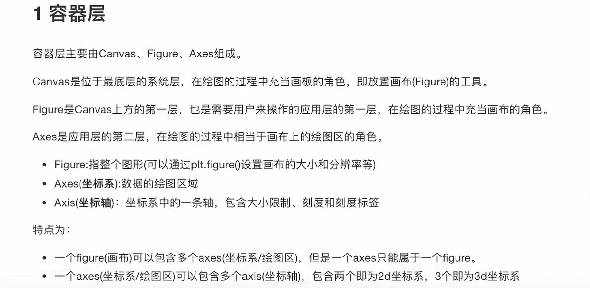

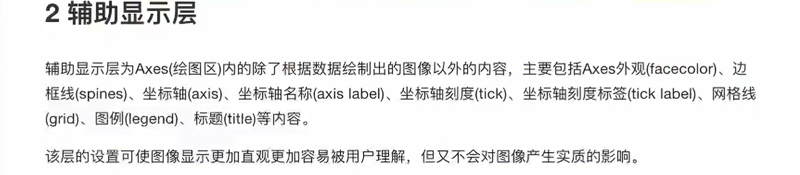


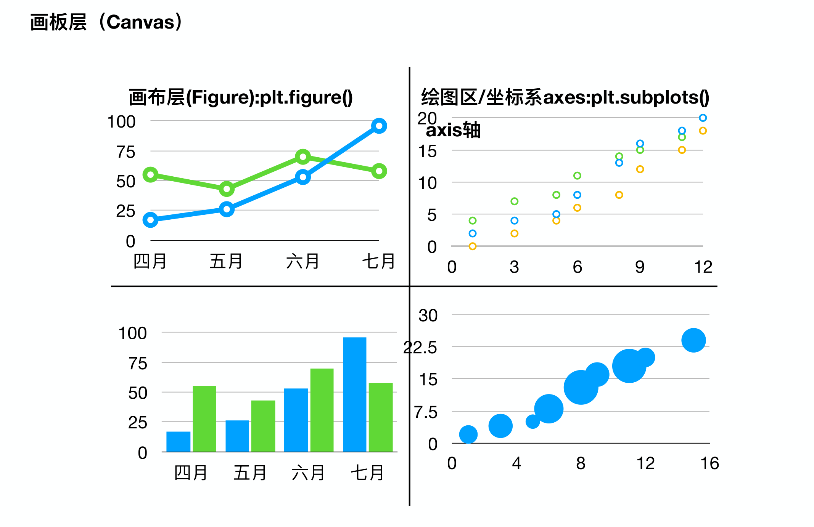

## 2.2 折线图(plot)与基础绘图功能
设置画布属性与图片保存
​        figsize : 画布大小
​        dpi : dot per inch 图像的清晰度
中文显示问题解决
​         mac的一次配置，一劳永逸
​         ubantu每创建一次新的虚拟环境，需要重新配置
​         windows
​        1）安装字体
​              mac/wins：双击安装
​              ubantu：双击安装
​        2）删除matplotlib缓存文件
​        3）配置文件
多个坐标系显示-plt.subplots(面向对象的画图方法)
​       figure, axes = plt.subplots(nrows=1, ncols=2, **fig_kw)
​       axes[0].方法名()
​       axes[1]
折线图的应用场景
​       某事物、某指标随时间的变化状况
​       拓展：画各种数学函数图像

```python
# 指定支持中文的字体
plt.rcParams['font.sans-serif'] = ['SimHei'] # 推荐使用SimHei字体显示中文
plt.rcParams['axes.unicode_minus'] = False # 解决保存图像是负号'-'显示为方块的问题
```


## 2.3 常见图形

常见图形种类及意义
    折线图plot
    散点图scatter
        关系/规律
    柱状图bar
        统计/对比
    直方图histogram
        分布状况
    饼图pie π
        占比

直方图介绍
            组数：在统计数据时，我们把数据按照不同的范围分成几个组，分成的组的个数称为组数
            组距：每一组两个端点的差
            已知 最高175.5 最矮150.5 组距5
            求 组数：(175.5 - 150.5) / 5 = 5

直方图与柱状图的对比

​	1 直方图展示数据的分布，柱状图比较数据的大小。

​	2 直方图X轴为定量数据，柱状图X轴为分类数据。

​	3 直方图柱子无间隔，柱状图柱子有间隔

​	4 直方图柱子宽度可不一，柱状图柱子宽度须一致

直方图绘制
	x = time
	bins 组数 = (max(time) - min(time)) // 组距
	直方图注意点

饼图(pie)
	%1.2f%%
	print("%1.2f%%")

## 2.4 总结

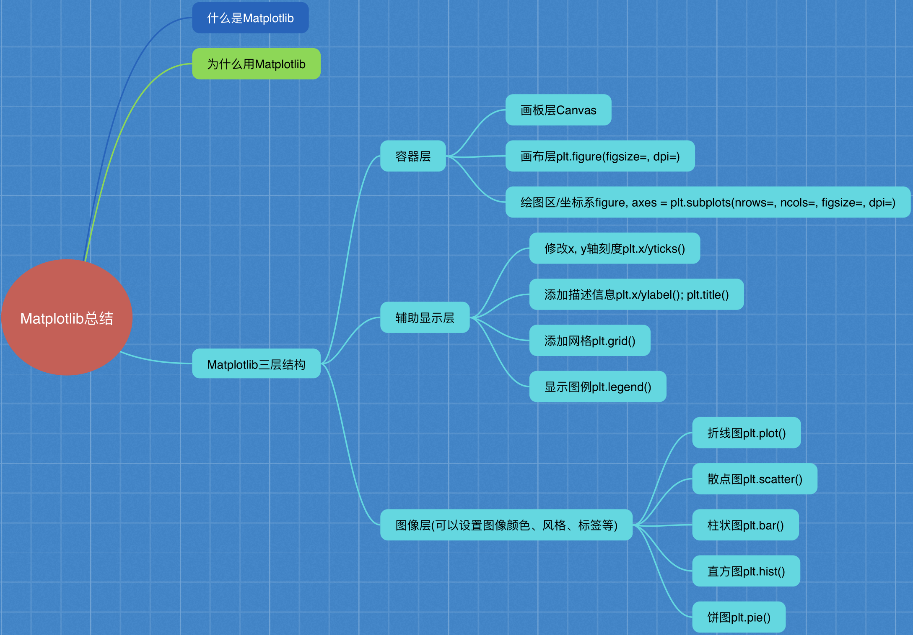


# Numpy

Numpy 高效的运算工具
Numpy的优势
ndarray属性
基本操作
    ndarray.方法()
    numpy.函数名()
ndarray运算
    逻辑运算
    统计运算
    数组间运算
合并、分割、IO操作、数据处理

## 3.1 Numpy优势
3.1.1 Numpy介绍 - 数值计算库
​        num - numerical 数值化的
​        py - python
​        ndarray
​            n - 任意个
​            d - dimension 维度
​            array - 数组

3.1.2 ndarray介绍

3.1.3 ndarray与Python原生list运算效率对比

3.1.4 ndarray的优势
​        1）存储风格
​            ndarray - 相同类型 - 通用性不强
​            list - 不同类型 - 通用性很强
​        2）并行化运算
​            ndarray支持向量化运算
​        3）底层语言
​            C语言，解除了GIL

## 3.2 ndarray属性

3.2.1 ndarray的属性
​        shape
​            ndim
​            size
​        dtype
​            itemsize
​        在创建ndarray的时候，如果没有指定类型
​        默认
​            整数 int64
​            浮点数 float64

3.2.2 ndarray的形状

3.2.3 ndarray的类型

## 3.3 基本操作
adarray.方法()
np.函数名()
​     np.array()

3.3.1 生成数组的方法
        1）生成0和1
            np.zeros(shape)
            np.ones(shape)
        2）从现有数组中生成
            np.array()    np.copy() 深拷贝
            np.asarray() 浅拷贝
        3）生成固定范围的数组
            np.linspace(0, 10, 100)
                [0, 10] 等距离

​			np.arange(a, b, c)

​				range(a, b, c)

​					[a, b) c是步长

​	    4）生成随机数组

​				分布状况 - 直方图

​				1）均匀分布

​						每组的可能性相等

​				2）正态分布
​    					σ 幅度、波动程度、集中程度、稳定性、离散程度

3.3.2 数组的索引、切片

3.3.3 形状修改
    ndarray.reshape(shape)    返回新的ndarray，原始数据没有改变
    ndarray.resize(shape)   没有返回值，对原始的ndarray进行了修改
    ndarray.T   转置 行变成列，列变成行。 返回新的ndarray，原始数据没有改变

3.3.4 类型修改
    ndarray.astype(type)
    ndarray序列化到本地	ndarray.tobytes()    

3.3.5 数组的去重
    set()  		np.unique(数组)

## 3.4 ndarray运算

3.4.1 逻辑运算
        布尔索引
        通用判断函数
            np.all(布尔值)
                只要有一个False就返回False，只有全是True才返回True
            np.any()
                只要有一个True就返回True，只有全是False才返回False
        np.where（三元运算符）
            np.where(布尔值, True的位置的值, False的位置的值)

3.4.2 统计运算
        统计指标函数
            min, max, mean, median, var, std
            np.函数名
            ndarray.方法名
        返回最大值、最小值所在位置
            np.argmax(temp, axis=)
            np.argmin(temp, axis=)

## 3.5 数组间运算

3.5.1 场景

3.5.2 数组与数的运算

3.5.3 数组与数组的运算

3.5.4 广播机制

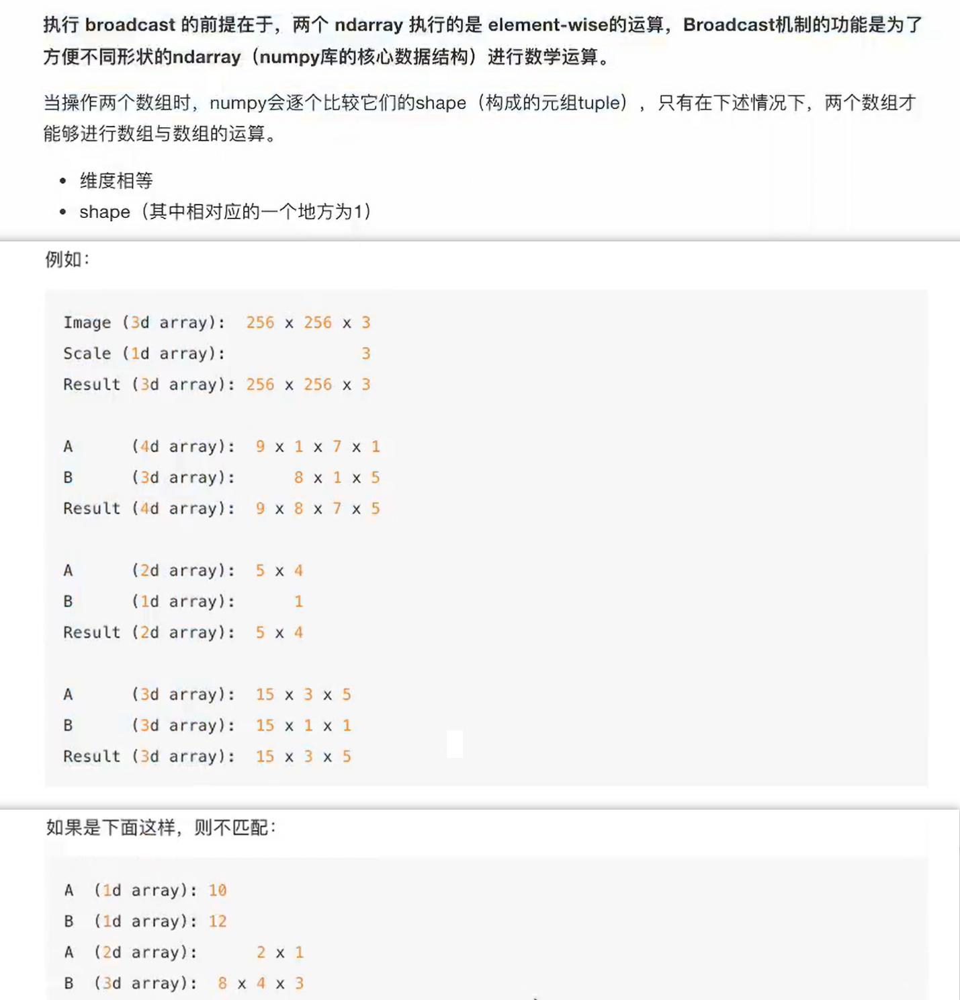

3.5.5 矩阵运算
            1 什么是矩阵
                矩阵matrix 二维数组
                两种方法存储矩阵
                    1）ndarray 二维数组	np.array()
                    2）matrix 数据结构	 np.asmatrix()

​            2 矩阵乘法运算
​                形状
​                运算规则
​                    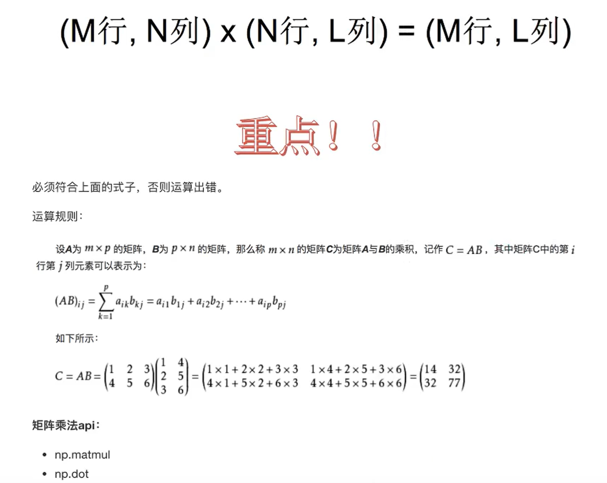


## 3.6 合并、分割

np.hstack((a, b))

np.concatenate((a, b), axis=1)

np.vstack((a, b))

np.concatenate((a, b), axis=0)

## 3.7 IO操作与数据处理

3.7.1 Numpy读取

3.7.2 如何处理缺失值
​        两种思路：
​            直接删除含有缺失值的样本
​            替换/插补
​                按列求平均，用平均值进行填补 

## 3.8 总结

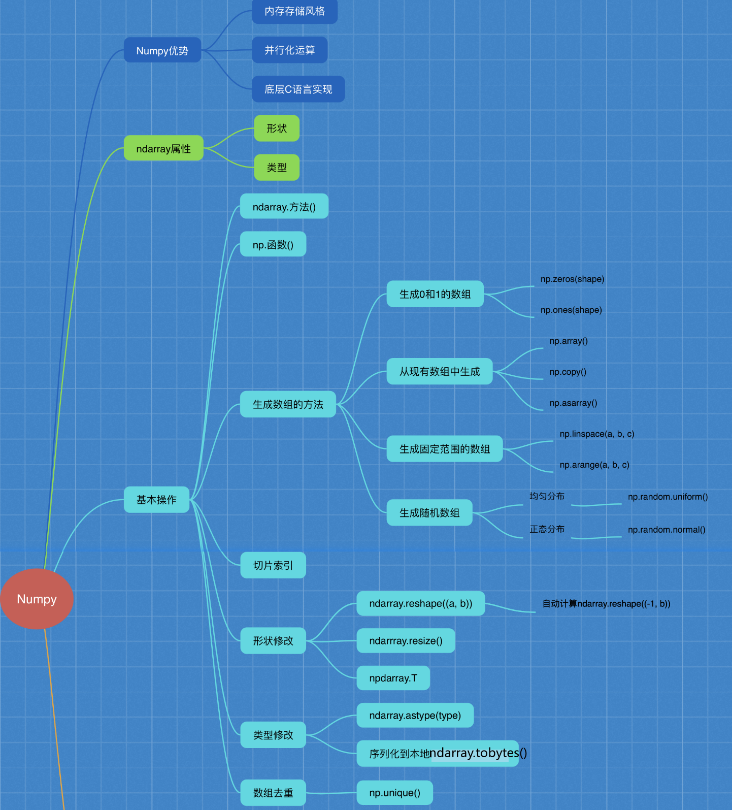

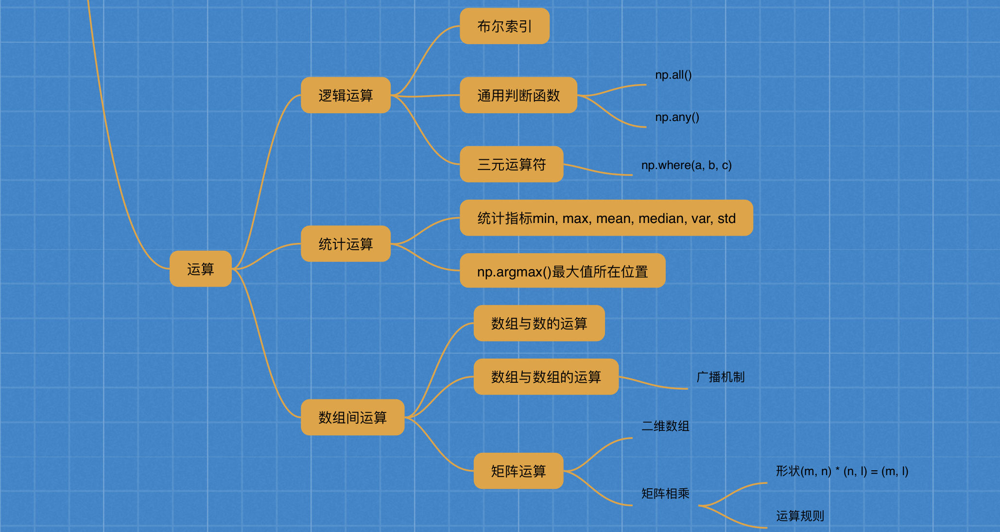


# Pandas

基础处理
        Pandas是什么？为什么用？
        核心数据结构
            DataFrame
            Panel（已弃用）
            Series
        基本操作
        运算
        画图
        文件的读取与存储

高级处理
    	缺失值处理
    	数据离散化
   	 合并
    	交叉表与透视表
    	分组与聚合
    	综合案例

## 4.1Pandas介绍
4.1.1 Pandas介绍 - 数据处理工具
        panel + data + analysis
        panel 面板数据 - 计量经济学  三维数据

4.1.2 为什么使用Pandas
        便捷的数据处理能力
        读取文件方便
        封装了Matplotlib、Numpy的画图和计算

4.1.3 核心数据结构

1 DataFrame
        结构：既有行索引，又有列索引的二维数组
        属性：
            shape
            index
            columns
            values
            T
        方法：
            head()
            tail()
        DataFrame索引的设置
            1）修改行列索引值
            2）重设索引
            3）设置新索引

2 Panel
        DataFrame的容器

3 Series
        带索引的一维数组
        属性
            index
            values

总结：
        DataFrame是Series的容器
        Panel是DataFrame的容器

## 4.2 基本数据操作
 4.2.1 索引操作
        1）直接索引
            先列后行
        2）按名字索引
            loc
        3）按数字索引
            iloc
        4）组合索引（已弃用）
            数字、名字

4.2.2 赋值操作

4.2.3 排序
        对内容排序
            dataframe
            series
        对索引排序
            dataframe
            series

## 4.3 DataFrame运算
算术运算

逻辑运算
        逻辑运算符 <、 >、|、 &
            布尔索引
        逻辑运算函数
            query()
            isin()

统计运算
        min()  max()  mean()  median()  var()  std()
        idxmax() 最大值所在位置
        idxmin()

累计统计函数  cumsum()  cummax()  cummin()  cumprod() 积

自定义运算
        apply(func, axis=0)True
            func:自定义函数

## 4.4 Pandas画图

sr.plot()
## 4.5 文件读取与存储
4.5.1 CSV
        pd.read_csv(path)
            usecols=
            names=
        dataframe.to_csv(path)
            columns=[]
            index=False
            header=False      mode="w"

4.5.2 HDF5
        hdf5 存储 3维数据的文件
            key1 dataframe1二维数据
            key2 dataframe2二维数据
        pd.read_hdf(path, key=)
        df.to_hdf(path, key=)

4.5.3 JSON
        pd.read_json(path)
            orient="records"
            lines=True
        df.to_json(patn)
            orient="records"
            lines=True

## 总结1

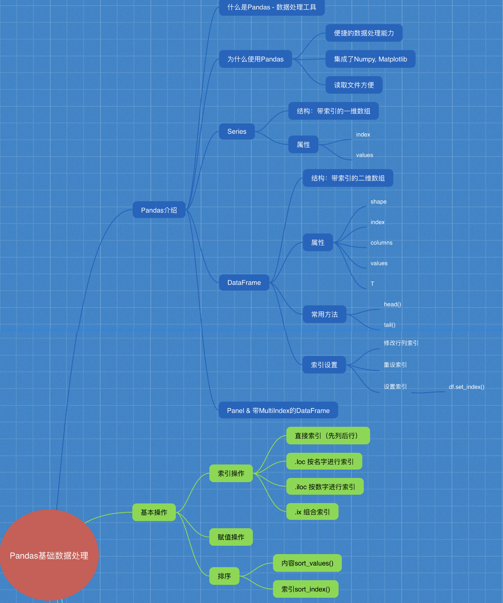

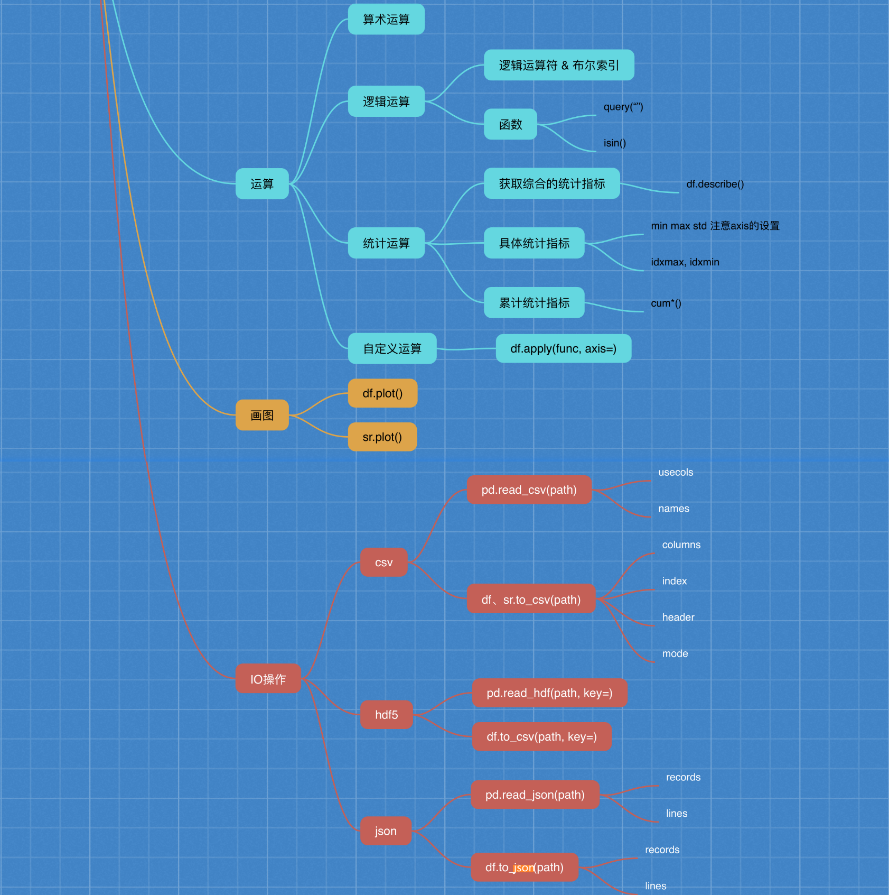


## 4.6 缺失值处理

如何进行缺失值处理
        两种思路：
            1）删除含有缺失值的样本
            2）替换/插补

4.6.1 如何处理nan
            1）判断数据中是否存在NaN
                pd.isnull(df).any()
                pd.notnull(df).all()
            2）删除含有缺失值的样本
                          df.dropna(inplace=False)
                 替换/插补
                		  df.fillna({col_name: value}, inplace=True)

4.6.2 不是缺失值nan，有默认标记的
            1）替换 ？-> np.nan
                df.replace(to_replace="?", value=np.nan)
            2）处理np.nan缺失值的步骤

## 4.7 数据离散化

​    性别 年龄
A    1   23
B    2   30
C    1   18
​    物种 毛发
A    1
B    2
C    3
​    男 女 年龄
A   1  0  23
B   0  1  30
C   1  0  18

​    狗  猪 老鼠 毛发

A   1   0   0   2
B   0   1   0   1
C   0   0   1   1

one-hot编码&哑变量

4.7.1 什么是数据的离散化
    原始的身高数据：165，174，160，180，159，163，192，184

4.7.2 为什么要离散化

4.7.3 如何实现数据的离散化
    1）分组
        自动分组 sr=pd.qcut(data, bins)
        自定义分组 sr=pd.cut(data, [])
    2）将分组好的结果转换成one-hot编码
        pd.get_dummies(sr, prefix=)

## 4.8 合并

numpy
        np.concatnate((a, b), axis=)
        水平拼接
            np.hstack()
        竖直拼接
            np.vstack()
1）按方向拼接
        pd.concat([data1, data2], axis=1)
2）按索引拼接
        pd.merge(left, right, how="inner", on=[索引])

## 4.9 交叉表与透视表

找到、探索两个变量之间的关系

4.9.1 交叉表与透视表什么作用

4.9.2 使用crosstab(交叉表)实现
        pd.crosstab(value1, value2)

4.9.3 pivot_table

## 4.10 分组与聚合

4.10.1 什么是分组与聚合

4.10.2 分组与聚合API
        dataframe
        sr

4.10.3 星巴克零售店铺数据案例

## 4.11 综合案例（电影）


## 总结2

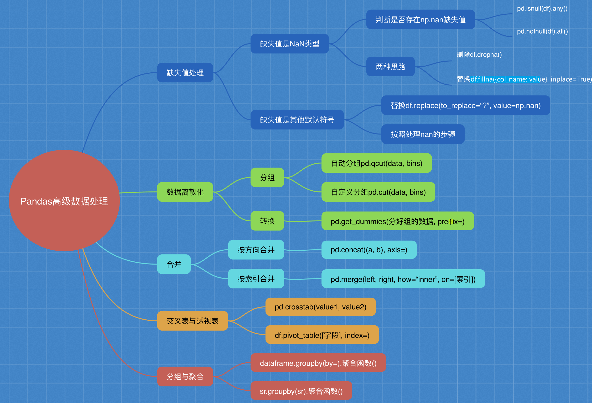